🚀 Despliegue de OpenLDAP y Configuración de Directorio

Este manual documenta el proceso técnico integral para crear un entorno de servidor de directorio profesional, utilizando OpenLDAP sobre un sistema Debian 11 (Bullseye).

---

## 📂 Fase 01: Actualización y Preparación del Entorno
El éxito de la instalación de OpenLDAP depende de un sistema base sólido y actualizado. En esta fase preparamos Debian 11 para los servicios de identidad.

### Paso 1.1: Actualización de Repositorios
Iniciamos sincronizando los índices de paquetes para asegurar que descargamos las versiones más recientes.
> **Comando:** `sudo apt update`

**Captura 01:**
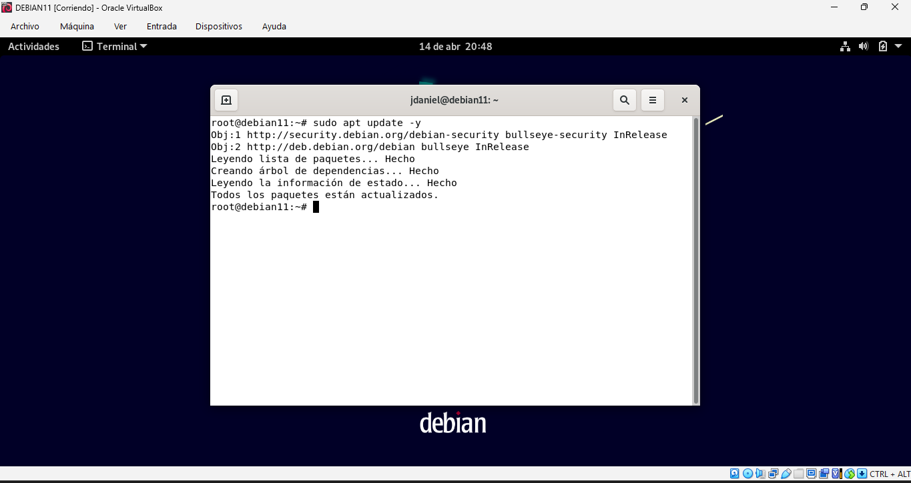

---

## 📂 Fase 02: Instalación de OpenLDAP
En esta etapa instalamos el núcleo del servicio de directorio y las herramientas necesarias para interactuar con él desde la línea de comandos.

### Paso 2.1: Instalación de paquetes (slapd y ldap-utils)
Ejecutamos la instalación del demonio LDAP y las utilidades de gestión.
> **Comando:** `sudo apt install slapd ldap-utils -y`

**Captura 01:**
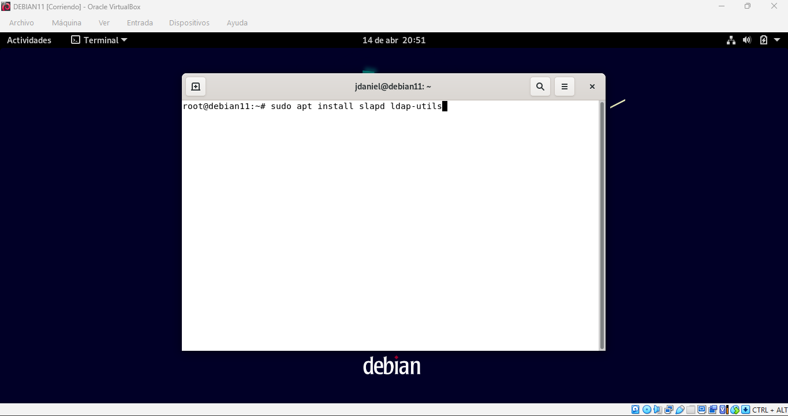

### Paso 2.2: Configuración de la contraseña del Administrador
Durante el proceso, el sistema solicitará definir una contraseña para el usuario `admin`. Esta credencial es fundamental para la gestión jerárquica del directorio.

**Captura 02:**
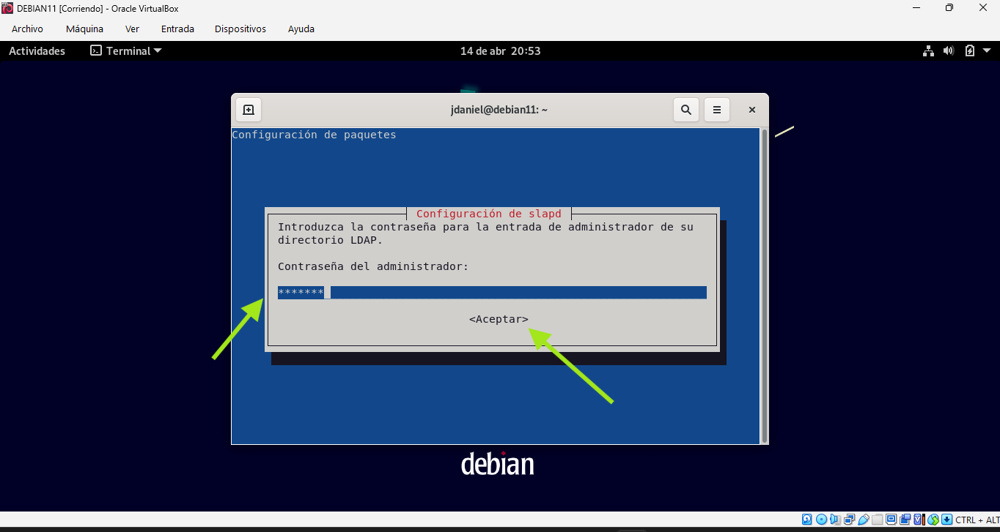

### Paso 2.3: Confirmación de Contraseña
Se debe reingresar la contraseña para validar que no existan errores de escritura.

**Captura 03:**
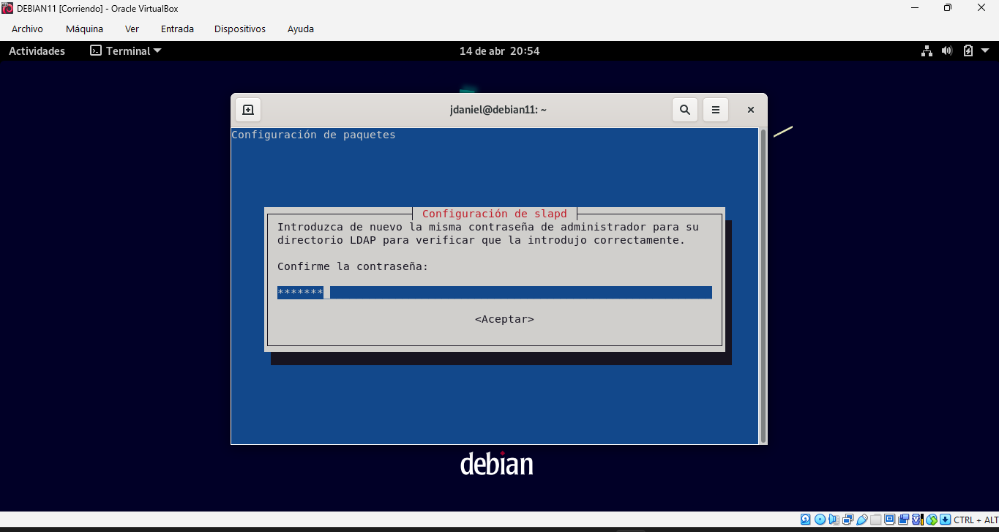

### Paso 2.4: Finalización de la Instalación
El instalador despliega la base de datos inicial y activa el demonio `slapd` en el sistema.

**Captura 04:**
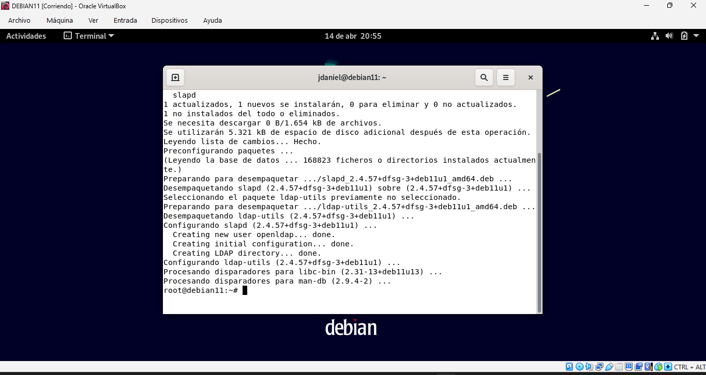

---

## 📂 Fase 03: Verificación del Servicio
Una vez finalizada la instalación, es imprescindible validar que el demonio `slapd` se encuentra en ejecución y operando sin errores en el sistema.

### Paso 3.1: Comprobación del estado del servicio
Utilizamos el sistema de control de servicios para verificar que OpenLDAP está "active (running)". Este paso confirma que el servidor está listo para recibir peticiones en el puerto 389.
> **Comando:** `sudo systemctl status slapd`

**Captura 01:**
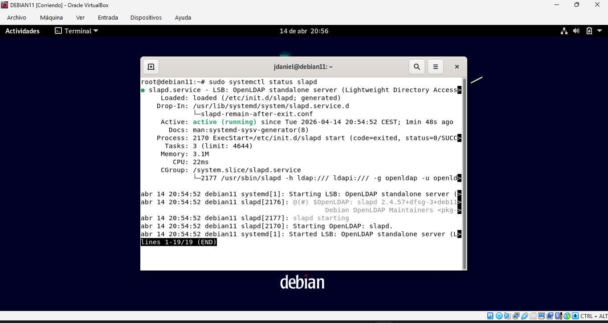

---

## 📂 Fase 04: Configuración del Servidor
En esta etapa personalizamos la instancia de OpenLDAP para definir la estructura del directorio (DN base) y la identidad de la organización.

### Paso 4.1: Ejecución del Asistente de Reconfiguración
Utilizamos la herramienta de gestión de paquetes para lanzar el asistente interactivo de `slapd`.
> **Comando:** `sudo dpkg-reconfigure slapd`

**Captura 01:**
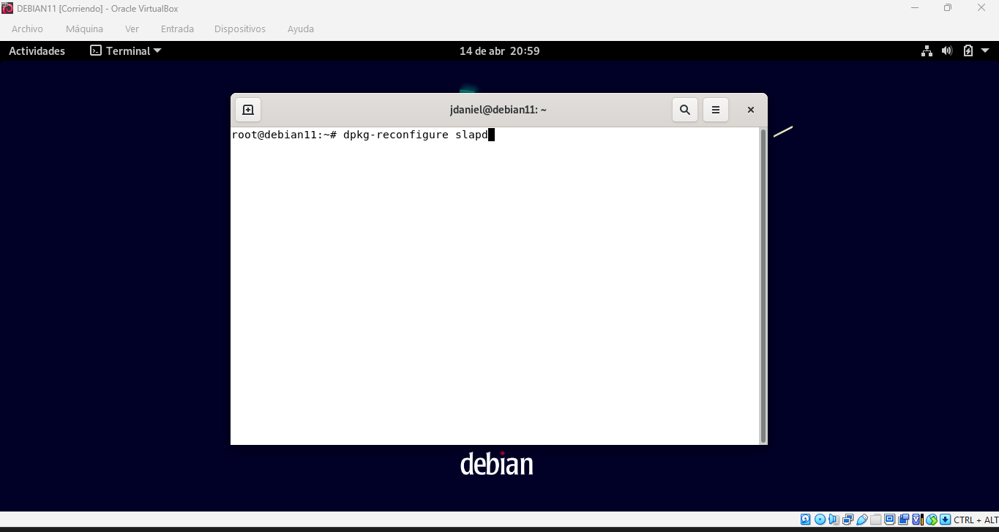

### Paso 4.2: Omisión de la Configuración Inicial
Se selecciona la opción "No" para permitir que el asistente nos guíe en la creación de una nueva base de datos personalizada.

**Captura 02:**
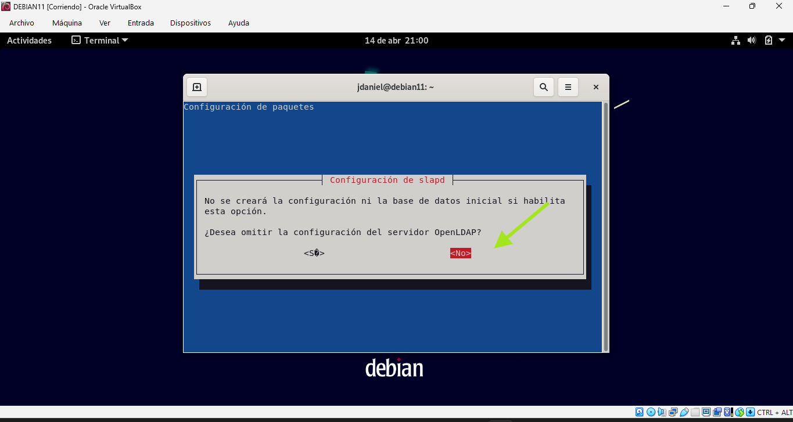

### Paso 4.3: Definición del Nombre de Dominio
Se introduce el nombre DNS que servirá para construir el Base DN del directorio (ej. `empresa.local`).

**Captura 03:**
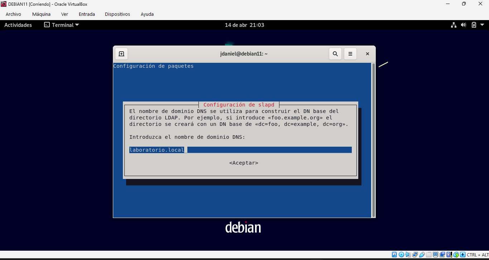

### Paso 4.4: Nombre de la Organización
Se especifica el nombre de la entidad que será utilizado en el DN base.

**Captura 04:**
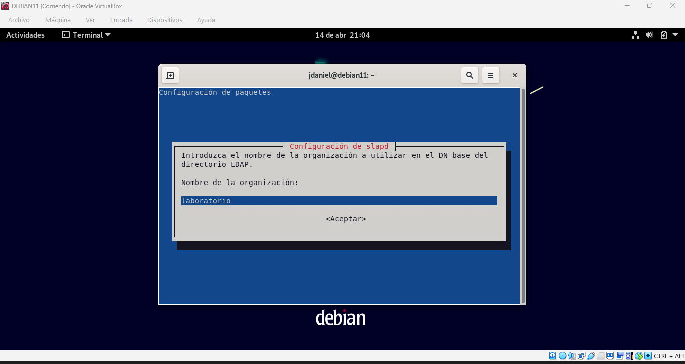

### Paso 4.5: Contraseña del Administrador
Se define y confirma la contraseña para la cuenta `admin` del nuevo directorio configurado.

**Capturas 05 y 06:**
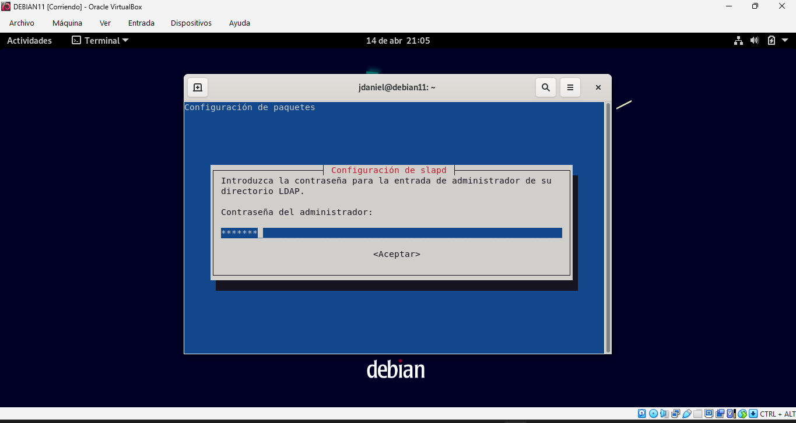
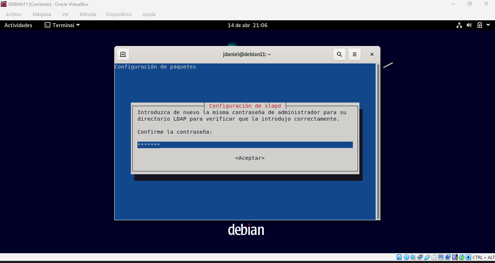

### Paso 4.6: Opciones de Base de Datos y Purga
Se configura el motor de base de datos y se decide si se desea eliminar la base de datos anterior (purgado) al desinstalar el paquete.

**Captura 07:**
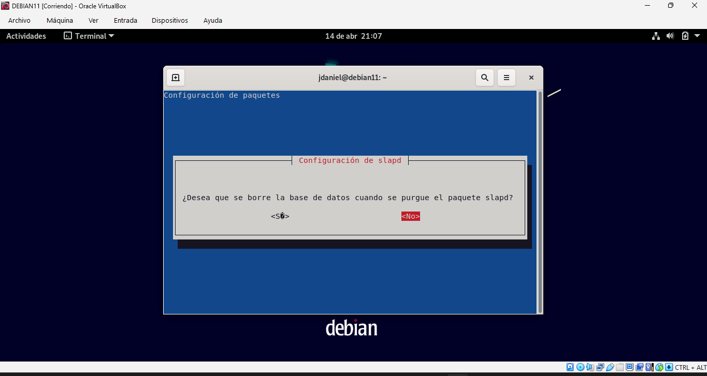

### Paso 4.7: Gestión de Base de Datos Antigua
Se confirma el movimiento de los archivos de la base de datos antigua para evitar conflictos con la nueva configuración.

**Captura 08:**
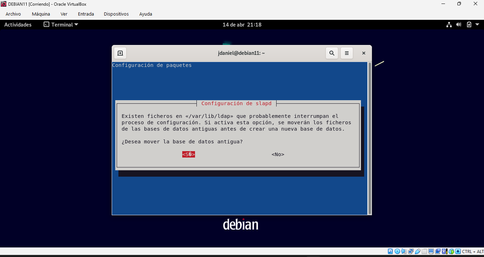

### Paso 4.8: Resumen y Finalización
El asistente aplica los cambios y muestra el resumen final de la configuración del servidor LDAP.

**Captura 09:**
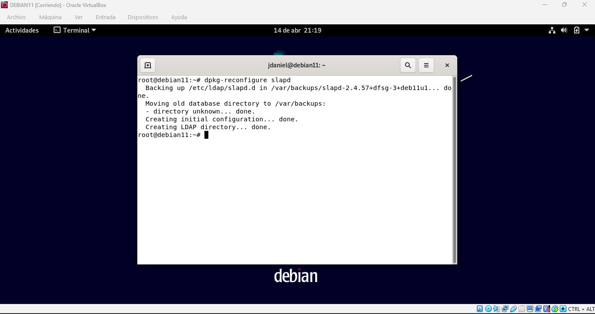.

---

## 📂 Fase 05: Prueba de Funcionamiento
Para concluir, se realiza una consulta de búsqueda inicial para verificar que la jerarquía LDAP se ha creado correctamente.

### Paso 5.1: Consulta Local (ldapsearch)
Ejecutamos una consulta a la raíz del servidor para confirmar que identifica correctamente los dominios que gestiona. 
> **Comando:** `ldapsearch -H ldap:// -x -s base -b "" -LLL "namingContexts"

**Captura 01:**
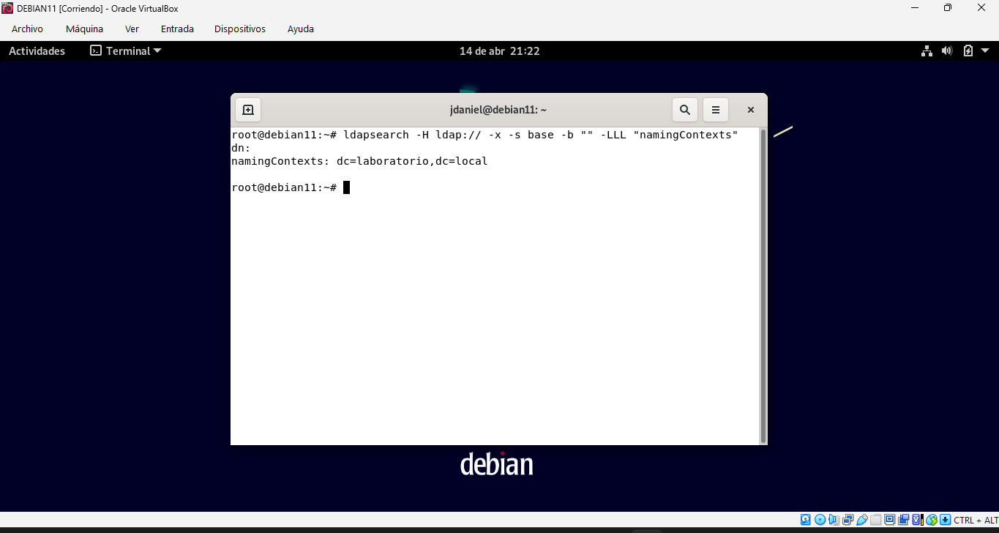

---

## 📂 Fase 06: Estructura de Directorio (LDIF)
En esta etapa, transformamos el servidor base en una estructura organizada mediante archivos de intercambio de datos (LDIF), creando las Unidades Organizativas (OU).

### Paso 6.1: Creación del archivo de definición
Diseñamos el fichero con los contenedores principales: `usuarios` y `grupos` bajo el dominio `dc=laboratorio,dc=local`.

**Captura 01 (Editor nano):**
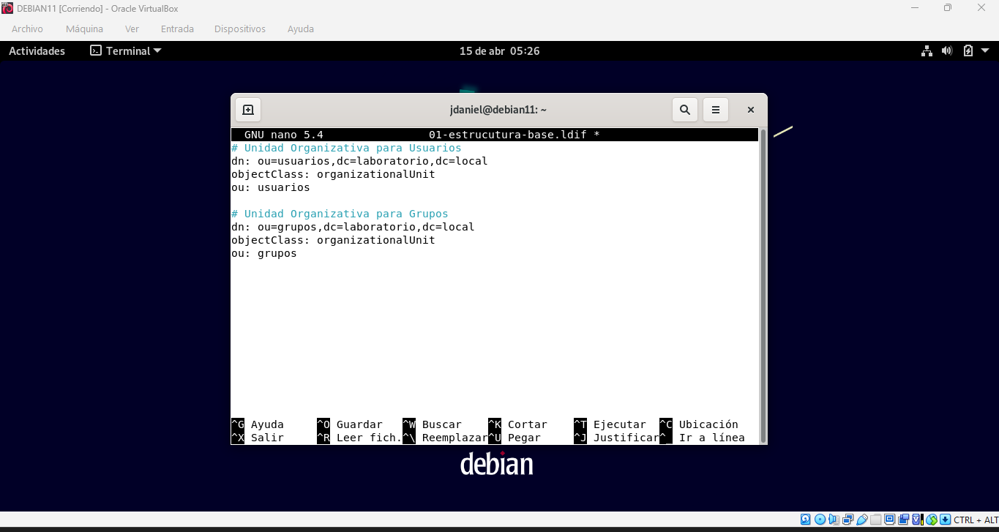

### Paso 6.2: Ejecución e Importación
Se utiliza la herramienta `ldapadd` para inyectar la configuración. Es necesario validar la ruta del archivo para evitar errores de "No such file or directory".

**Captura 02 (Comando de carga):**
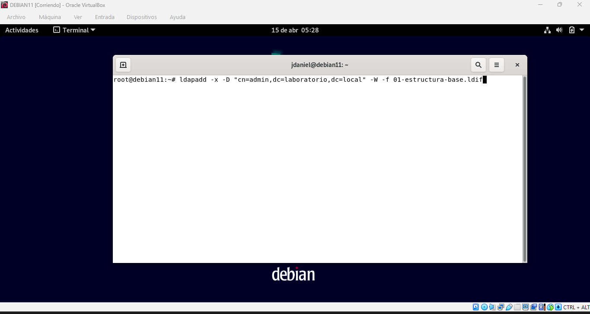

**Captura 03 (Éxito de la operación):**
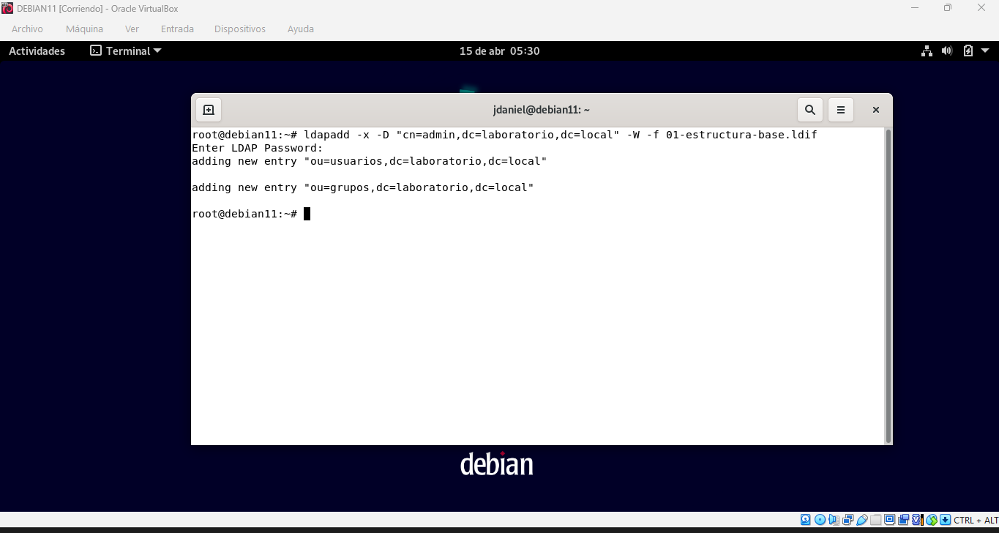

---

---

## 📂 Fase 07: Gestión de Usuarios (LDIF)
Una vez establecida la estructura jerárquica del dominio `laboratorio.local`, procedemos a la creación de usuarios mediante archivos de intercambio de datos (LDIF). Este método permite definir de forma precisa atributos de red y de sistema.

### Paso 7.1: Preparación del entorno
Iniciamos la creación del archivo de configuración utilizando el editor `nano`. Este fichero contendrá todos los parámetros del nuevo objeto de usuario.
> **Comando:** `nano 02-crear-usuario.ldif`

**Captura 01:**
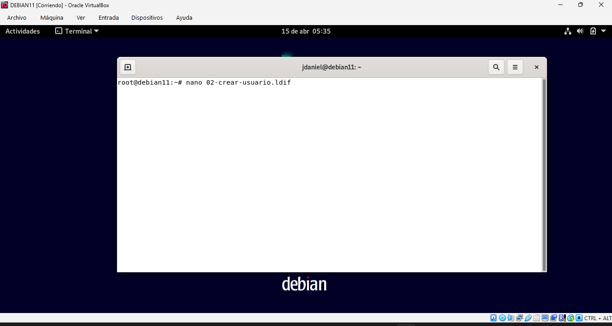

### Paso 7.2: Definición de atributos del usuario
Configuramos el usuario "alumno" asignándole las clases de objeto `inetOrgPerson`, `posixAccount` y `shadowAccount`. Definimos parámetros críticos como el `uidNumber`, `gidNumber`, la contraseña y el directorio `home`.

**Captura 02:**
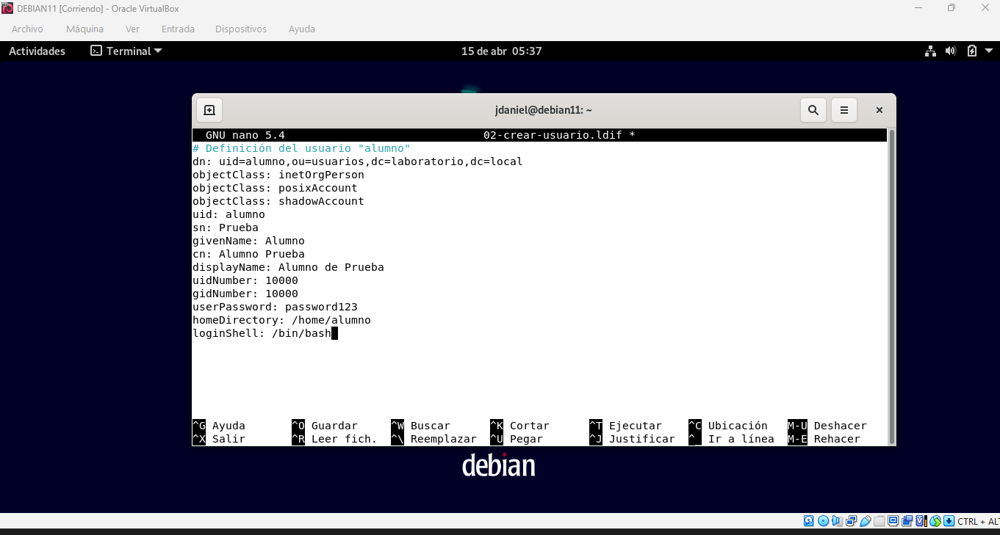

### Paso 7.3: Importación y Alta en el Sistema
Finalizamos el proceso inyectando el archivo LDIF en la base de datos de OpenLDAP. Tras introducir la contraseña de administrador, el servidor confirma la creación exitosa del registro.
> **Comando:** `ldapadd -x -D "cn=admin,dc=laboratorio,dc=local" -W -f 02-crear-usuario.ldif`

**Captura 04:**

## 🧠 Solución de Problemas (Troubleshooting)
En el despliegue de OpenLDAP es común encontrar errores de permisos o de conexión. Aquí tienes las soluciones a los fallos más frecuentes detectados en este laboratorio:

| Error Común | Causa Probable | Solución Sugerida |
| :--- | :--- | :--- |
| **`Can't contact LDAP server`** | El servicio `slapd` no está iniciado o el puerto 389 está bloqueado. | Ejecuta `sudo systemctl start slapd` y revisa el firewall. |
| **`Invalid credentials`** | La contraseña de `admin` no coincide con la configurada en la Fase 04. | Reconfigura con `sudo dpkg-reconfigure slapd`. |
| **`Insufficient access`** | Se intenta modificar el directorio sin usar `sudo` o el DN de administrador. | Asegúrate de ejecutar los comandos con privilegios elevados. |
| **`NamingContexts vacío`** | Error en la definición del dominio durante la reconfiguración. | Verifica que el "Base DN" coincida con tu dominio en `/etc/ldap/ldap.conf`. |

### 🔍 Depuración en tiempo real
Si el servicio no arranca, puedes ver qué está pasando exactamente con este comando:
> `sudo tail -f /var/log/syslog | grep slapd`

---

## 🚀 Hoja de Ruta (Próximos Pasos)
- [ ] **Fase 08:** Implementación de seguridad mediante TLS (LDAPS).
- [ ] **Fase 09:** Integración de un panel de gestión web (LAM).
